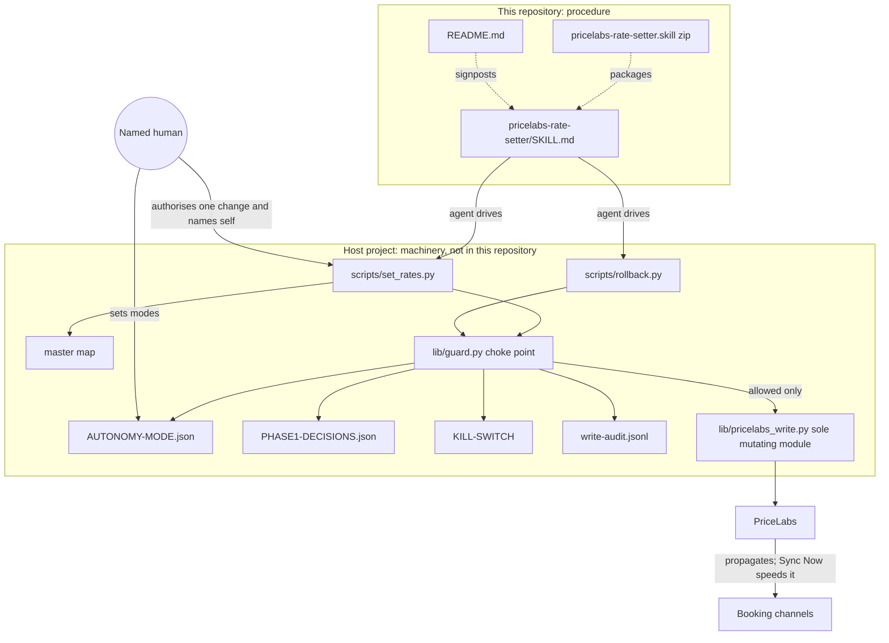

# System architecture

## Overview

Two layers, deliberately split across repositories ([[procedure-not-machinery]]).

**1. Procedure (this repository).** No executable code, configuration or tests.

- `pricelabs-rate-setter/SKILL.md`: a Claude Code skill. Its frontmatter `description` decides when it triggers ([[internal-variant-scoped-trigger]]); its body is the operating procedure.
- `pricelabs-rate-setter.skill`: the same SKILL.md packaged as an installable zip ([[skill-dir-plus-package]]).
- `README.md`: scope, signposting to the portable sibling, install notes, dependency warning.

**2. Machinery (the host project, not in this repository).** Referenced by relative path only; roles as the skill documents them.

| host path | role |
|---|---|
| `scripts/set_rates.py` | Entry point. Dry run unless `--execute`; resolves the unit from the master map and refuses unknown names; prints live values, effective mode and one guard verdict per change; reads back every applied change. |
| `lib/guard.py` | The choke point: mode, caps, kill switch, approvals, audit. |
| `lib/pricelabs_write.py` | The only module permitted to issue a mutating PriceLabs call. |
| `analysis/AUTONOMY-MODE.json` | Global and per-unit modes; changed only by a human. |
| `analysis/PHASE1-DECISIONS.json` | Cap configuration and the pricing objective. |
| `analysis/audit/write-audit.jsonl` | Every guard decision, allowed and denied. |
| `KILL-SWITCH` (host root) | Halt marker; may also be tripped by a circuit breaker. |
| `scripts/rollback.py` | Plans or executes reversal from the audit log, through the guard. |
| `scripts/build_master_map.py` | Rebuilds unit identity when a unit is unknown. |
| `scripts/revenue_report.py` | Rent versus guest-facing comparison used in the judgment check. |
| `analysis/shadow/` | Shadow-run reports and the last attended capture of channel promotions. |
| `AUTONOMY-PROTOCOL.md` | Standing prohibitions and authorisations. |

## Module graph

The edge from PriceLabs to the channels is inferred: the skill says changes reach the channels, and that Sync Now shortens the delay, but not by which route.

## Constraints

- **Fail closed.** Missing or unreadable guard configuration denies; the fix is the configuration, never a bypass.
- **One write path.** Every mutation, rollback included, passes the guard and one writing module. Rollback is not a side door ([[rollback-and-halt]]).
- **Authority stays human.** Execution, approver identity, cap overrides and mode changes are human decisions ([[propose-never-authorise]]).
- **Limited levers.** The skill sets or rolls back base and minimum prices. A maximum price is not a permitted lever; individual dates are capped with a date override instead.
- **Not standalone.** It works only inside the host project, with that project's code and local credential configuration.
- **Documented, not verified here.** Guard behaviour is described from the skill and commit messages; the guard source is not in this repository.
