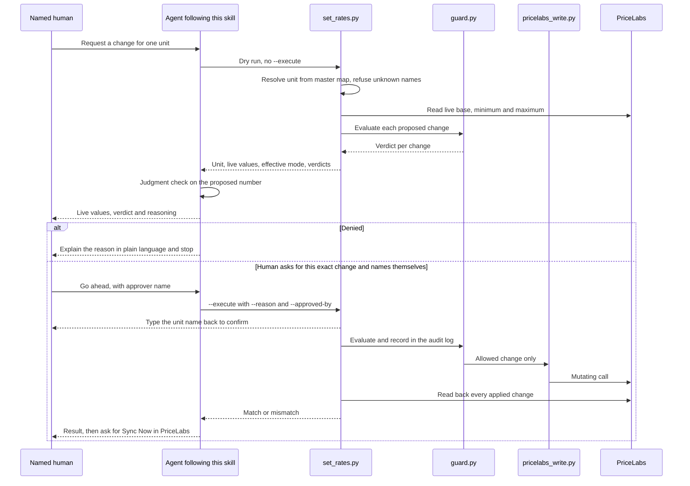

# Key flows

## End-to-end path of a typical request

A human asks for a price change on one unit. The order of operations is evidenced by the skill; steps inside the host project are as the skill documents them. Where the dry run reads its live values from, and whether the guard re-checks at execution, are inferred.

### The steps, and why each exists

1. **Pin the unit.** Identity comes from the master map, never from a name that happens to match. An unknown unit means rebuilding the map, not forcing a match.
2. **Read what is live.** A number quoted from a report may be hours or days stale.
3. **Judgment check before proposing.** Four questions: the scope of the lever (a base change moves every date, so a soft period gets a date-limited override instead); fee load versus rent (a high guest-facing price caused by fees is not fixed by cutting rent); remaining inventory (raising a sold-out calendar is noise); channel-side discounts, which stack on top of whatever PriceLabs pushes. If a shadow run already recommended the change, cite its report rather than re-deriving.
4. **Dry run and verdict.** Seconds of cost, and the whole safety margin. Denials are handled per [[guard-verdicts]].
5. **Authorise.** Only when the human asked for that specific change; the approver is a name the human gave ([[propose-never-authorise]]).
6. **Execute.** `--reason` enters the permanent audit record, so it is written for a reader six months later: what moved, and what evidence. The typed-back confirmation is a human checkpoint; `--yes` may replace it only when the human already approved this exact change in the conversation.
7. **Verify.** A success response is not proof the value stuck. On a mismatch, stop and investigate rather than retrying.
8. **Sync.** The human presses Sync Now in PriceLabs. Without it, propagation is slow enough that someone may conclude the change failed and cut again.

## Other important flows

- **Rollback.** Plan from the audit log by unit or run id, execute only with a named approver, always through the guard ([[rollback-and-halt]]).
- **Halt.** When the portfolio moves in a way nobody can explain, the agent engages the kill switch with a reason. Release is a human decision, after the cause is understood ([[rollback-and-halt]]).
- **Unknown unit.** Rebuild the master map; never force a match.
- **Denial.** Report the reason and stop; no retry, no workaround ([[guard-verdicts]]).
