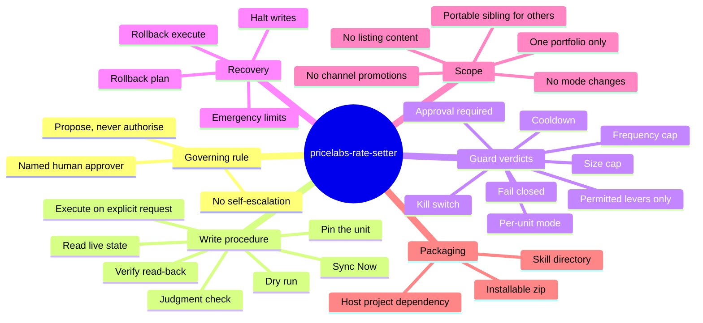

# Feature mindmap

## Feature mindmap

Branches of the skill as it stands (evidenced from `pricelabs-rate-setter/SKILL.md` and `README.md`).

Where each branch lives in the brain:

- Governing rule: [[propose-never-authorise]]
- Guard verdicts: [[guard-verdicts]]
- Recovery: [[rollback-and-halt]]
- Scope: [[internal-variant-scoped-trigger]] and [[procedure-not-machinery]]
- Packaging: [[skill-dir-plus-package]]
- Write procedure: the flow root page
