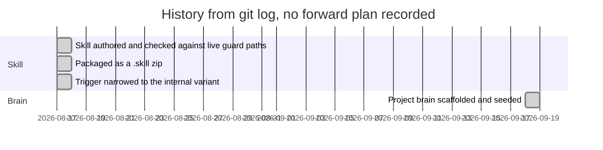

# Roadmap

## Milestones

The repository records no forward plan. The chart below is history taken from `git log`, not a schedule.

- 2026-08-17: skill written and its denial table matched to the guard's messages; selected guard paths exercised against live systems ([[guard-verdicts]], [[propose-never-authorise]]).
- 2026-08-17: packaged as an installable zip next to the skill directory ([[skill-dir-plus-package]]).
- 2026-08-17: once a portable sibling existed, the description was narrowed so the two never compete ([[internal-variant-scoped-trigger]]).
- 2026-09-18: project brain added.

## Open questions (need the owner; nothing below is planned)

1. **Consolidation.** Will the other OwnerRez skills the README names as candidates move into this repository? If so, does the single-skill repository name change?
2. **Keeping the two variants aligned.** The internal variant and the portable sibling carry the same discipline. How a fix in one reaches the other is not recorded.
3. **Re-verifying the verdict table.** It was matched to the guard once. What triggers a re-check when the host guard changes?
4. **Live coverage.** The founding commit lists which guard paths were exercised live. The frequency cap, cooldown, kill switch and fail-closed paths were matched by text only. Should they be exercised?
5. **Package automation.** Should a build or check keep the zip in lockstep with SKILL.md?
6. **Emergency rollback authority.** Whether the agent may choose `--emergency` without explicit human instruction is unstated ([[rollback-and-halt]]).
