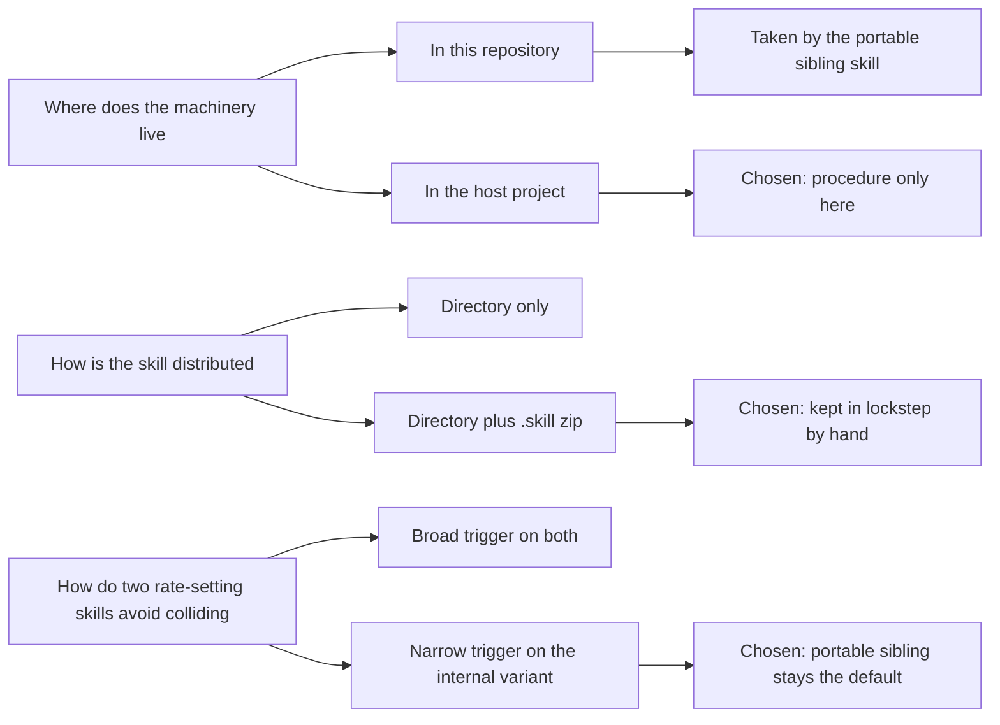

# Tech stack

## Technology choices

| domain | candidates | decision | rationale |
|---|---|---|---|
| Skill format | Claude Code skill | `SKILL.md` with YAML frontmatter | The frontmatter `description` controls triggering; the body is the procedure. Evidenced. |
| Distribution | Directory only; directory plus `.skill` zip | Directory plus zip | Matches a layout already used by a sibling skill repository; the zip is installable. Evidenced ([[skill-dir-plus-package]]). |
| Installation | Project-level `.claude/skills/`; user-level `~/.claude/skills/` | Either, by `git clone` | README. |
| Machinery | Ship tooling in this repository; depend on the host project | Depend on the host project | Keeps the host's internal analysis out of a shareable repository ([[procedure-not-machinery]]). The portable sibling took the other branch. |
| Host tooling language | n/a | Python | Inferred from the `python scripts/...` invocations; the code is not in this repository. |
| Write target | PriceLabs | PriceLabs | The only system the skill changes; changes reach the channels after a sync. |
| Property-management context | OwnerRez | Referenced only | The description scopes the skill to an OwnerRez + PriceLabs portfolio. No OwnerRez write step appears in the procedure (inferred: the skill writes nothing to OwnerRez). |
| Version control | Git, hosted on GitHub | Git | Three commits, all dated 2026-08-17. |
| Project memory | brain.md CLI | Adopted 2026-09-18 | `.gitattributes` pins `BRAIN.md` and `brain/` to LF line endings because this CLI version misreads CRLF. |

## Decision mindmap

## Open items

- **Package build is manual.** No build script, check or CI exists in the repository. On 2026-09-18 the packaged SKILL.md matched the source apart from line endings.
- **Zip entry separator.** The package's single entry is stored with a backslash separator (`pricelabs-rate-setter\SKILL.md`), which suggests it was built with a Windows tool. The zip format expects forward slashes, so some extractors on other platforms may create a file with a literal backslash in its name instead of a folder. Not tested; low confidence.
- **No tests here.** The only invariant checkable inside this repository is that the package matches the source.
- **Clone-into-skills-folder install.** The README clones the repository straight into a skills folder. `git clone` refuses a non-empty target, so this works only where the folder is empty or absent. Intent unconfirmed.
- **Verdict text can drift.** The skill quotes the host guard's messages ([[guard-verdicts]]). Nothing here detects a change in the guard's wording.
